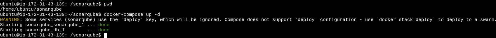
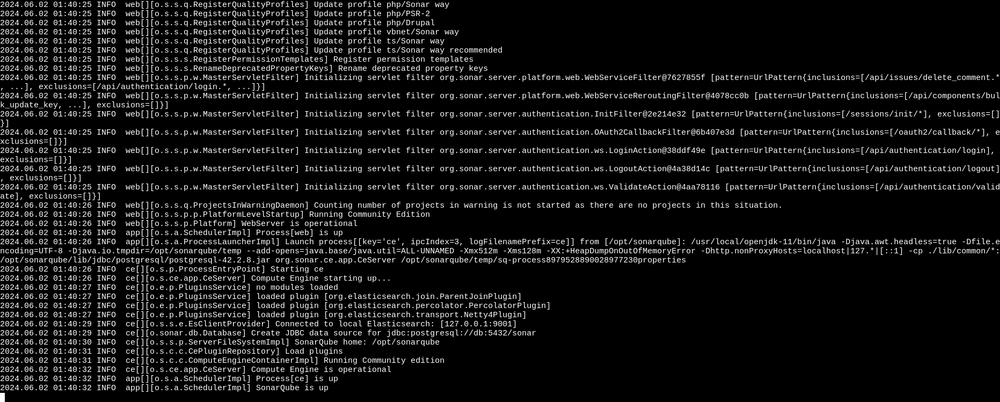
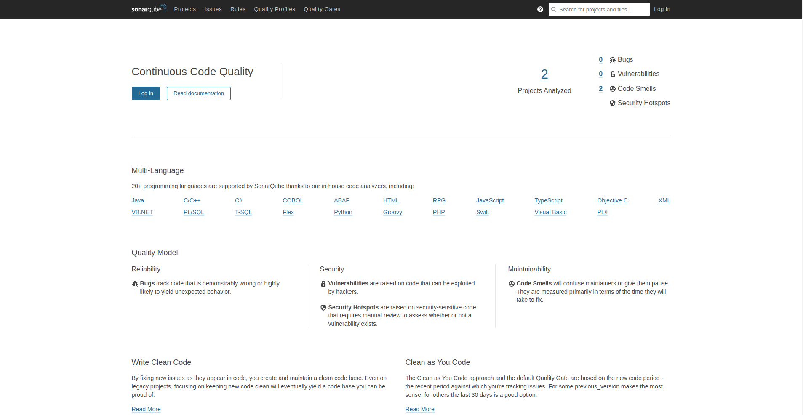
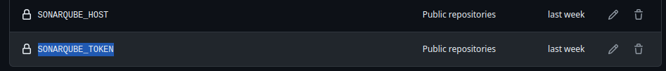
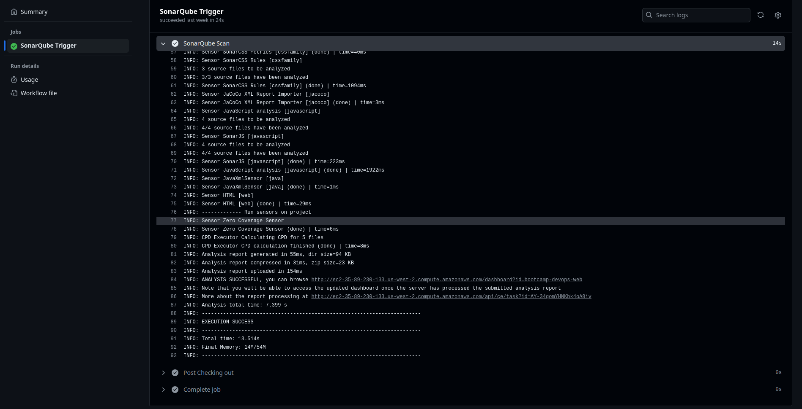
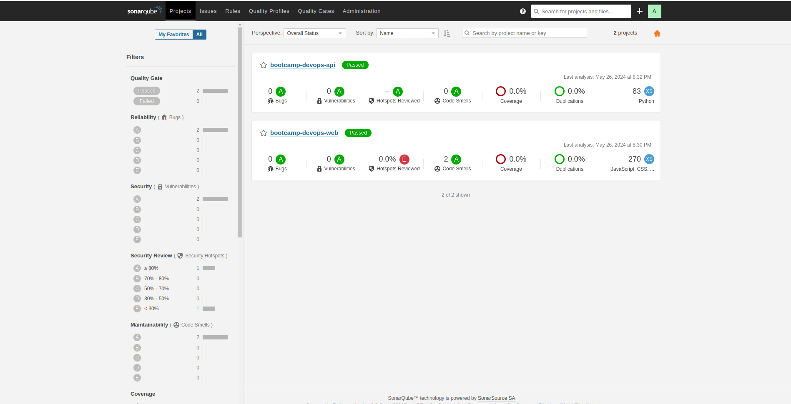
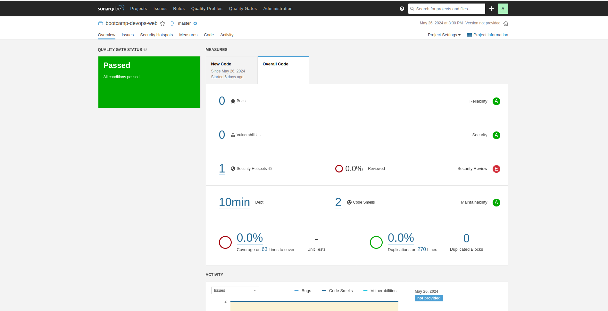

# DevOps Bootcamp

Se puede encontrar la documentacion en la [Wiki](https://github.com/devops-bootcamp-sre/bootcamp-devops-gitops/wiki/DevOps-Bootcamp) del proyecto 

## Menú de Navegación

- [Introducción](#introducción)
- [Tecnologías y Herramientas Utilizadas](#tecnologías-y-herramientas-utilizadas)
- [Estructura del Repositorio](#estructura-del-repositorio)
- [Definición de Infraestructura con Terraform](#definición-de-infraestructura-con-terraform)
- [Proceso de Despliegue](#proceso-de-despliegue)
    


## Introducción
Este proyecto utiliza un flujo de GitOps para gestionar y desplegar aplicaciones en un clúster de Kubernetes en AWS. Utilizamos varias herramientas y tecnologías para garantizar un ciclo de vida continuo de integración y entrega (CI/CD), monitoreo y gestión de la infraestructura.

## Tecnologías y Herramientas Utilizadas

- **AWS (Amazon Web Services)**
- **Kubernetes**
- **Terraform**
- **GitHub Actions**
- **SonarQube**
- **Docker**
- **Kustomization**
- **ArgoCD**
- **Prometheus**
- **Grafana**

## Estructura del Repositorio
El repositorio principal del proyecto es `bootcamp-devops-gitops`, que actúa como la fuente de verdad. Aquí se almacenan todos los servicios con los manifiestos necesarios para crear el deployment en Kubernetes. La estructura del repositorio es la siguiente:

```plaintext
bootcamp-devops-gitops/
│
├── service_name/
│   ├── production/
│   │   ├── deployment.yaml
│   │   ├── service.yaml
│   │   └── kustomization.yaml
│   └── development/
│       ├── deployment.yaml
│       ├── service.yaml
│       └── kustomization.yaml
│
└── pipelines/
    └── service_name
```
## Definición de Infraestructura con Terraform (WIP)
Terraform se utiliza para definir y provisionar el clúster de Kubernetes y los componentes necesarios en AWS.

## Proceso de Despliegue

### Gestión de Código con GitHub
El código de la aplicación y las configuraciones se almacenan en repositorios de GitHub.

- El codigo para el backend de la applicacion vive en el el repo: [bootcamp-devops-api](https://github.com/devops-bootcamp-sre/bootcamp-devops-api).
- El codigo para el frontend de la applicacion vive en el el repo: [bootcamp-devops-web](https://github.com/devops-bootcamp-sre/bootcamp-devops-web).
- Lo manifiestos de kubernetes para la configuracion de los servicios vive en elrepo: [bootcamp-devops-gitops](https://github.com/devops-bootcamp-sre/bootcamp-devops-gitops).

### Integración Continua (CI) con GitHub Actions
En este proyecto, hemos utilizado GitHub Actions para implementar un flujo de Integración Continua (CI). A continuación se describen los pasos principales del flujo de trabajo:

**1. Construcción de la Imagen Docker**

El primer paso en nuestro flujo de CI es construir una imagen Docker. Esto se realiza utilizando un archivo Dockerfile presente en el repositorio. El proceso de construcción incluye:

- Configuración del entorno necesario.
- Instalación de dependencias.
- Copia del código fuente al contenedor.
- Compilación o configuración adicional según sea necesario.

**2. Etiquetado de la Imagen (Tagging)**

Una vez que la imagen Docker ha sido construida correctamente, el siguiente paso es etiquetar (taggear) la imagen. El etiquetado permite versionar la imagen y mantener un registro claro de las versiones construidas. Generalmente, se utilizan etiquetas que incluyen:

- El número de versión del proyecto.
- El identificador del commit o la fecha de construcción.

**3. Subida de la Imagen a Docker Hub**

Después de etiquetar la imagen, el siguiente paso es subirla a un registro de imágenes Docker, en este caso, Docker Hub. Esto facilita la distribución y despliegue de la imagen, ya que Docker Hub actúa como un repositorio centralizado accesible desde cualquier entorno que necesite ejecutar la imagen.

**4. Análisis de Vulnerabilidades con SonarQube**

Como parte de nuestro proceso de CI, hemos integrado SonarQube para realizar análisis de código y detección de vulnerabilidades. SonarQube proporciona un análisis estático del código fuente y genera informes sobre:

- Errores de codificación.
- Problemas de seguridad.
- ***Code smells*** o áreas de mejora.

Estos informes son esenciales para mantener la calidad y seguridad del código a lo largo del tiempo.

**5. Notificaciones a un Canal de Discord**

Finalmente, hemos configurado notificaciones para que se envíen a un canal de Discord. Estas notificaciones informan al equipo de desarrollo sobre el estado de las construcciones (builds) y cualquier problema detectado durante el proceso de CI. Esto ayuda a mantener a todos los miembros del equipo al tanto de la situación del proyecto y a responder rápidamente a cualquier problema.

#### Flujo de Trabajo en GitHub Actions

El flujo de trabajo de GitHub Actions se define en un archivo YAML dentro del directorio `.github/workflows/`. Este archivo especifica:

- Los disparadores (triggers) del flujo de trabajo (por ejemplo, push, pull request).
- Los trabajos (jobs) que se ejecutarán.
- Los pasos (steps) dentro de cada trabajo.

Cada paso puede incluir la ejecución de comandos, la utilización de acciones de terceros o la ejecución de scripts personalizados.

A continuación, se describen las secciones principales del archivo YAML utilizado en nuestro flujo de trabajo:

##### Disparadores (Triggers)

Especifican cuándo se debe ejecutar el flujo de trabajo. Ejemplos comunes incluyen:

- `on: push` - Se ejecuta en cada push al repositorio.
- `on: pull_request` - Se ejecuta en cada pull request creada o actualizada.

##### Trabajos (Jobs)

Define los trabajos que se ejecutarán en el flujo de trabajo. Cada trabajo puede tener múltiples pasos y puede ejecutarse en paralelo con otros trabajos. Ejemplos de trabajos incluyen:

- `build` - Para construir la imagen Docker.
- `analyze` - Para ejecutar el análisis con SonarQube.
- `deploy` - Para subir la imagen a Docker Hub.

3. **Gestión del Estado de las Aplicaciones**: 
    - Dentro del repositorio `bootcamp-devops-gitops`, los directorios `production` y `development` para cada servicio contienen los manifiestos de Kubernetes necesarios para crear o actualizar los deployments y services.
    - Para crear el servicio en Kubernetes, el mismo repositorio tiene otro directorio de aplicaciones para ArgoCD, donde detecta cambios y crea el deployment en caso de que no exista o lo modifica de acuerdo a los cambios.
4. **Entrega Continua con ArgoCD**: ArgoCD monitorea el directorio de aplicaciones en el repositorio y sincroniza el estado del clúster de Kubernetes con el estado definido en los manifiestos de Git. Detecta cualquier cambio y aplica las actualizaciones necesarias para mantener el clúster en el estado deseado.
6. **Monitoreo y Visualización con Prometheus y Grafana**: Prometheus recolecta métricas del clúster y las aplicaciones, y Grafana visualiza estas métricas en dashboards interactivos.

# SonarQube

El proceso que se realizo para instalar **SonarQube** y obtener los analizáis de forma exitosa fue el siguiente: 

### Crear instancia ec2 en AWS: 

Se creo una instancia **EC2** en **AWS** con las siguientes características: 
- `Tipo de instancia: t2.medium`
- `Plataforma: Ubuntu 24.04 (Linux)` 
- `CPU Virtuales: 2 `
- `Memoria: 8Gb `

### Generar archivo docker-compose

Para levantar **SonarQube** dentro de la instancia optamos por usar **Docker** y **Docker-Compose** ya que es mas factible en temas de recursos, se genero el archivo docker-compose: 

```plaintext
version: "3"
services:
  sonarqube:
    image: sonarqube:8.2-community
    expose:
      - 9000
    ports:
      - "127.0.0.1:9000:9000"
    networks:
      - sonarnet
    environment:
      - SONARQUBE_JDBC_URL=jdbc:postgresql://db:5432/sonar
      - SONARQUBE_JDBC_USERNAME=sonar
      - SONARQUBE_JDBC_PASSWORD=sonar
    volumes:
      - sonarqube_conff:/opt/sonarqube/conf
      - sonarqube_dataa:/opt/sonarqube/data
      - sonarqube_extensionss:/opt/sonarqube/extensions
      - sonarqube_bundled-pluginss:/opt/sonarqube/lib/bundled-plugins
    deploy:
      resources:
        limits:
          cpus: '0.001'
          memory: 500M
        reservations:
          cpus: '0.0001'
          memory: 200M

  db:
    image: postgres
    networks:
      - sonarnet
    environment:
      - POSTGRES_USER=sonar
      - POSTGRES_PASSWORD=sonar
    volumes:
      - postgresqll:/var/lib/postgresql
      - postgresql_dataa:/var/lib/postgresql/data

networks:
  sonarnet:

volumes:
  sonarqube_conff:
  sonarqube_dataa:
  sonarqube_extensionss:
  sonarqube_bundled-pluginss:
  postgresqll:
  postgresql_dataa:
```
En el cual estamos levantando la herramienta con su respectiva base de datos **(Postgresql)** al igual como su red compartida y algunos volúmenes para respaldar información en caso de que los contenedores se borren por alguna razón.

### Levantar contenedores

Se creo una carpeta llamada **SonarQube** y dentro de ella se guardo el archivo docker-compose,  una ves que se guardo correctamente nos situamos en la carpeta y ejecutamos el siguiente comando: 

- `docker-compose up -d`



Estos son algunos de los logs que pinta el **SonarQube** para validar que levanto correctamente: 



### Exponer SonarQube

Para ver el sitio desde el navegador y pueda ser alcanzable desde **Github-Actions** (herramienta que se uso como CI y para ejecutar el análisis de código estático), tuvimos que abrir el puerto 80 en el grupo de seguridad de la instancia **EC2** y instalar un servidor web para exponerlo en el puerto indicado. 
Para este caso usamos **apache2**, agregamos el archivo de configuración que requiere apache en esta ruta `/etc/apache2/sites-available` con la siguiente sintaxis: 

```plaintext
ProxyRequests Off
ProxyPreserveHost On
<VirtualHost *:80>
  ServerName www.public_sonar.com
  ServerAdmin admin@prueba.com
  ProxyPass / http://localhost:9000/
  ProxyPassReverse / http://www.public_sonar.com/
  ErrorLog ${APACHE_LOG_DIR}/error.log
  CustomLog ${APACHE_LOG_DIR}/access.log combined
</VirtualHost>
```
Bajamos el sitio que estaba respondiendo por default con este comando: 
- `sudo a2dissite 000-default.conf`

Y habilitamos el nuestro con los siguiente comandos:
- `sudo a2ensite sonar.conf`
- `systemctl reload apache2`

Y así es como se ve la plataforma desde el navegador: 



### Integrar SonarQube con Github-Actions

En este proceso es necesario obtener dos variables desde el **SonarQube**:  
- `SONARQUBE_HOST: endpoint publico del SonarQube`
- `SONARQUBE_TOKEN: este es el token utilizado para autenticar el acceso a SonarQube` 

Ya que prácticamente es la comunicación que realizara **Github** con **SonarQube**, estas variables tienen que guardarse como secretos dentro del repositorio o a nivel organización:



Una ves que tengamos nuestras variables, podemos continuar con el archivo de configuración en **Github-Actions** para el análisis de código, el cual quedo de la siguiente forma:

```plaintext
name: SonarQube Scan
on:
  push:
    branches:
      - main
  pull_request:
      types: [opened, synchronize, reopened]
jobs:
  sonarqube:
    name: SonarQube Trigger
    runs-on: ubuntu-latest
    steps:
    - name: Checking out
      uses: actions/checkout@master
      with:
        fetch-depth: 0
    - name: SonarQube Scan
      uses: kitabisa/sonarqube-action@v1.2.0
      with:
        host: ${{ secrets.SONARQUBE_HOST }}
        login: ${{ secrets.SONARQUBE_TOKEN }}
        projectKey: "bootcamp-devops-api"
```

A grandes rasgos el archivo contiene la comunicación con **SonarQube** así como el nombre del repositorio que esta analizando, esto para que guarde el proyecto con el mismo nombre que se tiene en **Github** y queden totalmente homologados.

Cada que se abra un pr a la rama productiva se ejecutara el análisis para detectar bugs, vulnerabilities , code smells y security hotspots (este proceso se realizo tanto el el repositorio para el servicio backend como para el repositorio que contiene la aplicación web). Esta es una salida de lo que nos pinta nuestro CI:



Y así es como se ve finalmente en **SonarQube**, con el detalle especifico del análisis de código:





